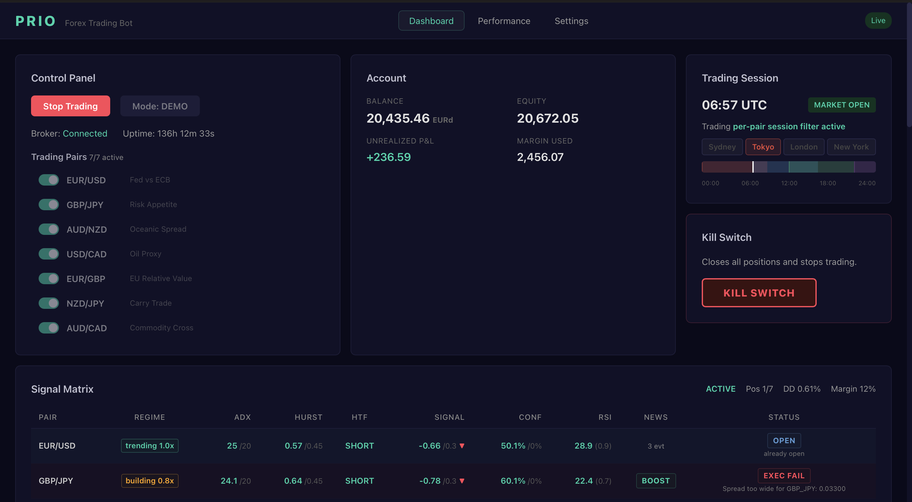
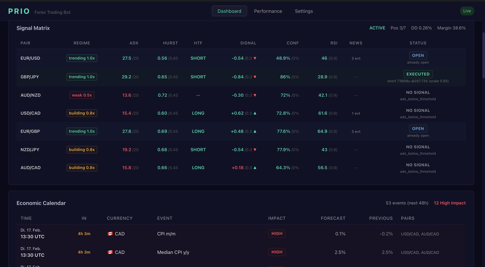

<div align="center">

# PRIO

### Autonomous Forex Trading Bot

[](https://python.org)
[](https://fastapi.tiangolo.com)
[](https://react.dev)
[](https://docker.com)
[](LICENSE)


[Features](#features) · [Architecture](#architecture) · [Installation](#installation) · [Configuration](#configuration) · [Dashboard](#dashboard) · [Deployment](#deployment)


</div>


## Features

### Strategy Engine

- **Multi-Speed EMA Blending** — Three speed layers (Fast/Medium/Slow) with configurable weights
- **Higher-Timeframe Confirmation** — H4 confirmation prevents trades against the dominant trend
- **ADX Gate** — Filters out trendless market phases (threshold: 20)
- **Hurst Exponent Filter** — Detects mean-reversion regimes and blocks entries when H < 0.45
- **Session Filter** — Optional restriction to active market hours only
- **Confidence Scoring** — Dynamic scoring based on signal strength, Hurst and RSI

### Risk Management

| Component | Description |
|---|---|
| **Pre-Trade Gates** | Spread, margin, cooldown (exponential), loss limits, correlation matrix |
| **Position Sizing** | Regime scaling, confidence scaling, volatility targeting |
| **Trailing Stop** | ATR-based with seamless handoff from break-even |
| **Break-Even** | Automatic SL shift to entry after +1.0 ATR profit |
| **Drawdown Recovery** | 4-phase system with automatic position reduction |
| **Kill Switch** | Immediate trading halt at hard-stop drawdown (15%) |

### Execution Engine

- Order queue with retry logic and latency monitoring
- SL/TP verification + automatic repair
- Broker-side exit detection (SL/TP hit, margin call)
- Reconciliation between broker and local database

### Data Pipeline

- **Multi-Timeframe Candles** — M5, M15, H1, H4, D1 in parallel
- **Technical Indicators** — EMA, RSI, MACD, Bollinger Bands, ATR, ADX, Hurst, KAMA, Realized Volatility
- **Correlation Matrix** — Prevents cluster risk on correlated pairs
- **Economic Calendar** — Forex Factory integration with blackout filter, post-event boost and currency-specific overrides


## Architecture

```
┌─────────────────────────────────────────────────────────┐
│                     Orchestrator                        │
│          (Trading · Equity · Position · Calendar)       │
├──────────┬──────────┬──────────┬────────────────────────┤
│ Strategy │   Risk   │Execution │     Data Pipeline      │
│          │Management│  Engine  │                        │
│ - Trend  │ - Gates  │ - Orders │ - Candles (MT)         │
│ - Multi  │ - Sizing │ - SL/TP  │ - Indicators           │
│   Speed  │ - Stops  │ - Recon  │ - Calendar             │
│ - HTF    │ - Draw-  │ - Kill   │ - Correlation          │
│ - Hurst  │   down   │   Switch │                        │
├──────────┴──────────┴──────────┴────────────────────────┤
│                    Broker Layer                         │
│           (Capital.com API · Rate Limiting)             │
├─────────────────────────────────────────────────────────┤
│          Infrastructure & Interface                     │
│  SQLite · EventBus · FastAPI · WebSocket · Telegram     │
└─────────────────────────────────────────────────────────┘
```


## Traded Pairs

| Pair | Rationale |
|------|-----------|
| EUR/USD | Fed vs ECB — benchmark |
| GBP/JPY | Risk appetite (GBP risk-on, JPY safe haven) |
| AUD/NZD | Oceanic spread (RBA vs RBNZ) |
| USD/CAD | Oil proxy (Canada = oil exporter) |
| EUR/GBP | European relative value (no USD exposure) |
| NZD/JPY | Carry trade (high-yield vs low-yield) |
| AUD/CAD | Commodity cross (iron ore vs oil) |

---

## Installation

### Prerequisites

- Python 3.12+
- Node.js 20+ (for the dashboard)
- Docker & Docker Compose (optional)

### Local Setup

```bash
# Clone the repository
git clone https://github.com/Plain2Code/prio.git
cd prio

# Install Python dependencies
pip install -e ".[dev]"

# Configure environment
cp .env.example .env
# Fill in your API keys in .env

# Start the bot
python -m src.main
```

### Start the Dashboard

```bash
cd dashboard
npm install
npm run dev
# Dashboard runs at http://localhost:5173
```

---

## Configuration

### Environment Variables (`.env`)

```env
# Capital.com API
CAPITALCOM_API_KEY=your-api-key
CAPITALCOM_IDENTIFIER=your-email@example.com
CAPITALCOM_PASSWORD=your-password
CAPITALCOM_ENVIRONMENT=demo          # demo = sandbox server, live = real-money server

# Telegram Notifications
TELEGRAM_BOT_TOKEN=your-bot-token
TELEGRAM_CHAT_ID=your-chat-id
TELEGRAM_ENABLED=false

# API
API_SECRET_KEY=change-this-to-a-random-secret-key

# Trading
TRADING_MODE=paper                   # paper = simulated orders, live = real orders
```

> **Note:** `CAPITALCOM_ENVIRONMENT` determines which broker server is used (demo vs live API). `TRADING_MODE` determines whether orders are actually executed. For real-money trading, both must be set to `live`.

### Trading Configuration (`config/default.yaml`)

All strategy, risk, and system parameters are configured centrally in `config/default.yaml` (EMA periods, drawdown limits, trailing stop, calendar blackouts, backtest settings, etc.).

---

## Dashboard

The React dashboard provides real-time insights via WebSocket:




**Features:**
- Live equity curve & drawdown visualization
- Open positions with real-time P&L
- Trade history & performance statistics
- System status & diagnostics
- Configuration management

**API Endpoints:**

| Route | Description |
|-------|-------------|
| `GET /api/trading/*` | Positions, trades, signals |
| `GET /api/dashboard/*` | Equity, stats, performance |
| `GET /api/config/*` | Read/write configuration |
| `GET /api/system/*` | Health, diagnostics, kill switch |
| `WS /ws` | Real-time updates |

**Signal Matrix Verdicts:**

The signal matrix shows the current status of each pair in the trading loop:

| Verdict | Meaning |
|---------|---------|
| `EXECUTED` | Trade was executed |
| `NO_DATA` | No candle data available |
| `NO_SIGNAL` | Strategy did not generate a signal |
| `OUTSIDE_SESSION` | Outside active trading hours |
| `POSITION_OPEN` | Pair already has an open position |
| `RISK_BLOCK` | Pre-trade risk check failed |
| `NEWS_BLOCK` | Economic calendar blackout active |
| `SIZE_ZERO` | Position size after sizing = 0 (too little equity / high volatility) |
| `COOLDOWN` | Trade cooldown still active |
| `EXEC_COOLDOWN` | Cooldown after failed execution |
| `DAILY_LOSS` | Daily loss limit reached |
| `WEEKLY_LOSS` | Weekly loss limit reached |
| `SPREAD_REJECT` | Spread too wide for entry |
| `EXEC_FAILED` | Order execution failed |
| `ERROR` | Unexpected error |

---

## Telegram Integration

PRIO sends automatic notifications:

- **Trade Alerts** — New trades & closed positions
- **Drawdown Warnings** — When the alert threshold is exceeded (5%)
- **Kill Switch** — Immediate notification on trading halt
- **Daily Summary** — Daily performance report
- **System Errors** — Errors & connection losses

---

## Deployment

### Docker Compose (recommended)

```bash
# Development
docker compose up -d

# Production (with dashboard)
docker compose -f docker-compose.prod.yml up -d
```

### Docker Targets

| Target | Description |
|--------|-------------|
| `trader` | Headless trading bot (no dashboard) |
| `production` | API + bot + React dashboard on port 8000 |

---

## Tech Stack

| Layer | Technology |
|-------|------------|
| **Backend** | Python 3.12, FastAPI, asyncio |
| **Frontend** | React 18, TypeScript, Vite, Recharts |
| **Database** | SQLite (aiosqlite) |
| **Broker** | Capital.com REST API |
| **Messaging** | Telegram Bot API |
| **Infrastructure** | Docker, Docker Compose |
| **Testing** | pytest, pytest-asyncio |
| **Linting** | Ruff |

---

<div align="center">

**PRIO** — Built for autonomous trading.

</div>
